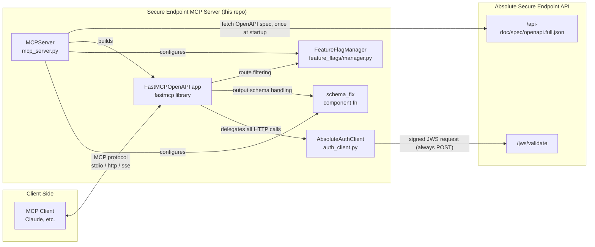
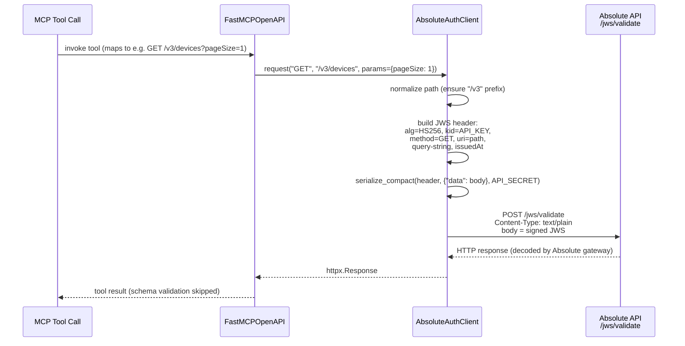

# Secure Endpoint MCP Server — Architecture & Technical Specification

**Status:** Reference documentation (describes the system as implemented)
**Audience:** Contributors and reviewers onboarding to this codebase
**Scope:** `secure-endpoint-mcp-server` repository, as of commit `9fb8316`

## 1. Overview

The Secure Endpoint MCP Server exposes the [Absolute Security Secure Endpoint Public
API](https://api.absolute.com/api-doc/doc.html) as a set of [Model Context
Protocol](https://modelcontextprotocol.io/) (MCP) tools. It allows any MCP-compatible
client (Claude Desktop, Claude Code, or any other client in the [MCP client
list](https://modelcontextprotocol.io/clients)) to call Absolute's REST API through
natural-language tool invocations, without either side needing custom integration code.

**Key design principle: the tool surface is spec-driven, not hand-written.** The server
does not define individual MCP tools in code. Instead, at startup it fetches Absolute's
live OpenAPI document and uses FastMCP's `FastMCPOpenAPI` adapter to generate one MCP
tool per API operation automatically. This means:

- The tool surface always matches whatever the Absolute API currently exposes.
- Adding a new Absolute API endpoint requires no code change in this repository — it
  appears as a new tool the next time the server starts.
- Controlling *which* tools are exposed is done declaratively (feature flags, path
  blocklist), not by editing a list of tools.

The trade-off is a runtime dependency on the Absolute API's OpenAPI endpoint being
reachable and well-formed at startup (see [§10 Known Limitations](#10-known-limitations--risks)).

## 2. Architecture



**Components:**

| Component | File | Responsibility |
|---|---|---|
| `MCPServer` | `secure_endpoint_mcp/server/mcp_server.py` | Orchestrates startup: fetch spec, clean it, build the FastMCP app, register feature-flag groups, start the chosen transport. |
| `AbsoluteAuthClient` | `secure_endpoint_mcp/client/auth_client.py` | `httpx.AsyncClient` subclass that signs every outgoing request as a JWS and redirects it to Absolute's `/jws/validate` endpoint. |
| `FeatureFlagManager` | `secure_endpoint_mcp/feature_flags/manager.py` | Tracks which OpenAPI tag-derived "API groups" are enabled/disabled, based on `ABS_FEATURE_*` env vars. |
| `schema_fix` | `secure_endpoint_mcp/server/schema_fix.py` | FastMCP `mcp_component_fn` hook that disables per-tool output schema validation to work around broken `$ref`s in the Absolute OpenAPI spec. |
| `Settings` | `secure_endpoint_mcp/config/settings.py` | Pydantic settings loaded from environment variables / `.env`. |
| `logging` | `secure_endpoint_mcp/config/logging.py` | `structlog`-based JSON logging to stderr. |

## 3. Component Reference

### 3.1 `MCPServer` (`server/mcp_server.py`)

- Constructed once as the module-level singleton `mcp_server`.
- `initialize()`:
  1. Fetches the OpenAPI spec via `_fetch_openapi_spec()` (plain `httpx.AsyncClient`, no
     auth — this is a public doc endpoint).
  2. Recursively strips HTML from every `description` field in the spec
     (`_strip_html_from_description`), using `html2text`, to reduce token usage when the
     spec/tool descriptions are sent to an LLM.
  3. Extracts API groups from OpenAPI `tags` (`_extract_api_groups_from_openapi`) and
     registers each `(path, method)` pair with the `FeatureFlagManager`.
  4. Builds a `FastMCPOpenAPI` instance, passing:
     - the cleaned OpenAPI spec,
     - the `AbsoluteAuthClient` as the HTTP client FastMCP will use for every call,
     - `_route_map_fn` as the route-mapping function,
     - a schema-fixing `mcp_component_fn` with validation disabled.
- `_route_map_fn(route, mcp_type)`: for every OpenAPI route, decides whether to expose it
  as an MCP tool (`MCPType.TOOL`) or hide it (`MCPType.EXCLUDE`). Logic, in order:
  1. If the path contains `-advanced` and the blocklist is enabled (default), exclude.
  2. If `FeatureFlagManager.is_api_enabled()` returns `False`, exclude.
  3. Otherwise, map GET/POST/PUT/PATCH/DELETE to `MCPType.TOOL`.
- `start()`: calls `initialize()`, then dispatches to `run_http_async(transport="http")`,
  `run_http_async(transport="sse")`, or `run_stdio_async()` depending on
  `settings.TRANSPORT_MODE`.
- `stop()`: logs shutdown; no explicit resource teardown is performed today.

### 3.2 `AbsoluteAuthClient` (`client/auth_client.py`)

Subclasses `httpx.AsyncClient` and overrides `request()` so every call made by the
FastMCP-generated tools is transparently authenticated. See [§4](#4-request-lifecycle--auth-protocol)
for the full flow. Key points:

- Every request path is normalized to be prefixed with `/v3` (required for JWS signature
  correctness), independent of the FastMCP-provided URL.
- The *original* HTTP method (GET/POST/etc.) and path/query-string are embedded inside
  the signed JWS header — but the actual HTTP call to Absolute is **always** a `POST` to
  `/jws/validate`. Absolute's API gateway inspects the decoded JWS to determine the real
  operation.
- Signing uses `authlib.jose.JsonWebSignature` with `alg=HS256`, keyed by `API_SECRET`,
  with `kid=API_KEY`.

### 3.3 `FeatureFlagManager` (`feature_flags/manager.py`)

- Holds `_flags: Dict[str, bool]` (from env) and `_api_groups: Dict[str, Set[Tuple[path,
  method]]]` (populated by `MCPServer` at startup from OpenAPI tags).
- `is_api_enabled(path, method)`:
  - If no flags and no groups are registered at all → enabled (fail-open, but this state
    doesn't occur in practice since defaults always set `device-reporting`).
  - If the route belongs to a known group → return that group's flag value, defaulting
    to `False` (disabled) if the group has no explicit flag.
  - If the route belongs to no group at all → enabled by default.
- This means: **routes with tags are opt-in per group; routes without tags are always
  on** (subject to the advanced blocklist).

### 3.4 `schema_fix` (`server/schema_fix.py`)

- `create_schema_fixing_component_fn(disable_validation=True)` returns a function that
  FastMCP invokes once per generated tool/component.
- When `disable_validation` is `True`, it sets `component.output_schema = None`, which
  tells FastMCP to skip response validation. This is a deliberate workaround: parts of
  Absolute's OpenAPI spec contain schema `$ref`s that don't resolve (`PointerToNowhere`
  errors), which would otherwise break tool generation even though the underlying API
  call is fine. This is applied globally, for all tools, unconditionally, in
  `mcp_server.py`.

### 3.5 `Settings` (`config/settings.py`)

Pydantic `BaseSettings` reading from process environment and an optional `.env` file
(case-sensitive keys). See [§6](#6-configuration-reference) for the full variable table.
Also owns `get_feature_flags_from_env()`, which parses `ABS_FEATURE_*` variables into the
`{group-name: bool}` map consumed by `FeatureFlagManager`, and applies the
device-reporting-only default when no flags are set at all.

### 3.6 `logging` (`config/logging.py`)

- Configures both stdlib `logging` and `structlog` to emit single-line JSON to **stderr**
  (important: stdout is reserved for MCP stdio-transport protocol traffic).
- Log level comes from `settings.LOG_LEVEL`, mapped via `LOG_LEVEL_MAP`.
- Runs `configure_logging()` as a module-level side effect on import.

## 4. Request Lifecycle / Auth Protocol



Notes:

- Regardless of the semantic HTTP method of the underlying Absolute operation
  (GET/POST/PUT/PATCH/DELETE), the physical transport call to Absolute is always an HTTP
  `POST` to a single endpoint, `{API_HOST}/jws/validate`. The real method, path, and
  query string are only visible inside the decoded JWS payload/headers.
- The JSON body sent to Absolute is always wrapped as `{"data": <original json body or
  {}>}`.
- No token/session is cached or refreshed — every single tool call performs a fresh JWS
  signing operation using the static `API_KEY`/`API_SECRET` pair from settings.

## 5. Startup Sequence

```mermaid
x   ```

If the spec fetch fails (network error, non-2xx, invalid JSON), `initialize()` raises and
`main.py` propagates the exception after logging — the server does not start with a
partial or cached tool set.

## 6. Configuration Reference

All settings are environment variables (optionally via a `.env` file), defined in
`secure_endpoint_mcp/config/settings.py`.

| Variable | Default | Description |
|---|---|---|
| `API_KEY` | `""` (required in practice) | Absolute symmetric API key (token ID). Used as JWS `kid`. |
| `API_SECRET` | `""` (required in practice) | Absolute symmetric API secret. Used as the JWS signing key. |
| `API_HOST` | `https://api.absolute.com` | Base URL for both the OpenAPI spec fetch and the `/jws/validate` endpoint. |
| `HTTP_TIMEOUT_SECONDS` | `30` | Timeout applied to the underlying `httpx.AsyncClient`. |
| `SERVER_HOST` | `0.0.0.0` | Bind host, only relevant for `http`/`sse` transport. |
| `SERVER_PORT` | `8000` | Bind port, only relevant for `http`/`sse` transport. |
| `LOG_LEVEL` | `info` | One of `debug`, `info`, `warning`, `error`, `critical`. |
| `TRANSPORT_MODE` | `http` | One of `http`, `sse` (deprecated), `stdio`. |
| `DISABLE_ADVANCED_API_BLOCKLIST` | `False` | When `False` (default), any route with `-advanced` in its path is excluded from the MCP tool set. Set `True` to include them. |
| `ABS_FEATURE_<GROUP>` | none set → only `device-reporting` enabled | `enabled`/`disabled` per API group; group name derived from OpenAPI tag (see §7). |

`API_KEY`/`API_SECRET` default to empty strings at the type level, but the server cannot
successfully sign/validate requests to Absolute without real values — this is an
operational requirement, not enforced by a startup check.

## 7. Feature Flags & Advanced-API Blocklist

- Every OpenAPI operation's `tags` array is used to bucket its `(path, method)` into one
  or more "API groups". A tag like `Device Reporting` is transformed to
  `device-reporting` (lowercased, spaces → dashes).
- An operation can belong to multiple groups if it has multiple tags; it's enabled if
  *any* of the groups it belongs to is enabled (first match wins in the current
  implementation, since `is_api_enabled` iterates `_api_groups.items()` and returns on
  first membership found — in practice each path/method pair should only be associated
  with the flag of the group it's tested against).
- Groups are controlled via `ABS_FEATURE_<GROUP_NAME>=enabled|disabled` (case-insensitive
  value, underscores in the env var become dashes in the group name).
- **Default behavior when no `ABS_FEATURE_*` vars are set at all:** only
  `device-reporting` is enabled; every other tagged group is disabled. Untagged
  operations (if any exist in the spec) are always enabled regardless of flags.
- **Advanced API blocklist:** independent of feature flags, any route whose path
  contains the substring `-advanced` is excluded by default. This is a blanket
  safety/scope control, not tied to OpenAPI tags. Set
  `DISABLE_ADVANCED_API_BLOCKLIST=True` to lift it.
- Precedence order applied in `_route_map_fn`: advanced blocklist check first, then
  feature-flag check, then HTTP-method-based tool mapping.

## 8. Deployment & CI/CD

### 8.1 Docker

Multi-stage build (`Dockerfile`):

1. **Builder stage** — `python:3.13-slim` (pinned by digest). Installs `uv`, then
   installs the project with `uv pip install --system --no-cache-dir -e .`.
2. **Final stage** — `cgr.dev/chainguard/python:latest` (distroless, pinned by digest).
   Copies only the installed site-packages and application source from the builder;
   no shell, package manager, or build tooling present in the final image.
3. Sets `TRANSPORT_MODE=stdio` as the container default, `SERVER_HOST=0.0.0.0`,
   `SERVER_PORT=8000`, `PYTHONPATH=/app`. Entrypoint runs `main.py` directly via the
   distroless Python entrypoint (`CMD ["main.py"]`).

### 8.2 CI (`.github/workflows/ci.yml`)

Runs on push to `main` and on all pull requests:

1. Set up Python 3.13 + `uv`.
2. Install project with dev extras.
3. Lint: `black --check .`
4. Import order: `isort --check-only .`
5. Type check: `mypy .`
6. Tests: `pytest` with coverage (term + XML report, uploaded as an artifact).
7. Build (not push) a multi-platform (`linux/amd64`, `linux/arm64`) Docker image via
   Buildx/QEMU, as a build-health check only.

### 8.3 Release (`.github/workflows/release.yml`)

Triggered on `v*` tags (or manual dispatch):

1. Run tests.
2. Build Python sdist/wheel (`python -m build`), upload as artifacts.
3. Log in to GHCR.
4. Build and **push** a multi-platform Docker image to
   `ghcr.io/<owner>/secure-endpoint-mcp-server`, tagged via `docker/metadata-action`
   (semver tag + ref tag).

Note: PyPI publishing is referenced in the README ("Pypi (coming soon)") but not yet
wired into the release workflow — only GHCR image publishing and artifact upload are
automated today.

## 9. Testing Strategy

Located in `tests/`, run via `pytest` (config in `pyproject.toml`; `asyncio_mode = "auto"`).

| Test file | Covers |
|---|---|
| `test_auth_client.py` | `AbsoluteAuthClient` JWS payload construction and request redirection to `/jws/validate`. |
| `test_config.py` | `Settings` parsing, including `get_feature_flags_from_env()` behavior and defaults. |
| `test_feature_flags.py` | `FeatureFlagManager` group registration and `is_api_enabled()` logic. |
| `test_mcp_server.py` | `MCPServer` initialization flow, HTML stripping, route mapping, API group extraction — uses the `tests/openapi.json` fixture instead of a live network call. |

CI enforces `black`, `isort`, `mypy` (`disallow_untyped_defs`/`disallow_incomplete_defs`
strict outside of `tests/`), and coverage reporting on every PR.

## 10. Known Limitations & Risks

- **Startup-time hard dependency on a remote spec.** The OpenAPI document is fetched
  fresh from `API_HOST` on every server start with no local fallback or cache. If
  Absolute's spec endpoint is unreachable or returns a malformed document, the server
  fails to start entirely — there is no degraded/partial mode.
- **Output schema validation is disabled globally**, not just for the specific broken
  `$ref`s that motivated the workaround (`schema_fix.py`, invoked with
  `disable_validation=True` unconditionally in `mcp_server.py`). This trades correctness
  checking on tool responses for compatibility with the current spec's defects across
  *all* tools, not only the affected ones.
- **No live feature-flag/route disabling after the FastMCP app is built** — acknowledged
  directly in a code comment in `_extract_api_groups_from_openapi`. All enable/disable
  decisions must be known before `initialize()` completes; there's no supported way to
  toggle a group at runtime without restarting the process.
- **Static credentials, no rotation/refresh.** `API_KEY`/`API_SECRET` are read once at
  settings load time; there is no mechanism to rotate them without a restart.
- **Blocklist is substring-based** (`-advanced` in path) rather than tag- or
  metadata-based, so it depends on Absolute's path-naming convention remaining stable.
- **Feature-flag group resolution uses first-match iteration order** over a `dict` of
  sets; correctness relies on the assumption that a given `(path, method)` is only ever
  registered under one semantically relevant group flag, since Python dict iteration
  order (insertion order) determines which group's flag is checked first if it happens
  to appear in more than one group.
- **`SSE` transport is explicitly marked deprecated** in `TransportMode` but is still a
  supported, documented option — no removal timeline is defined.
